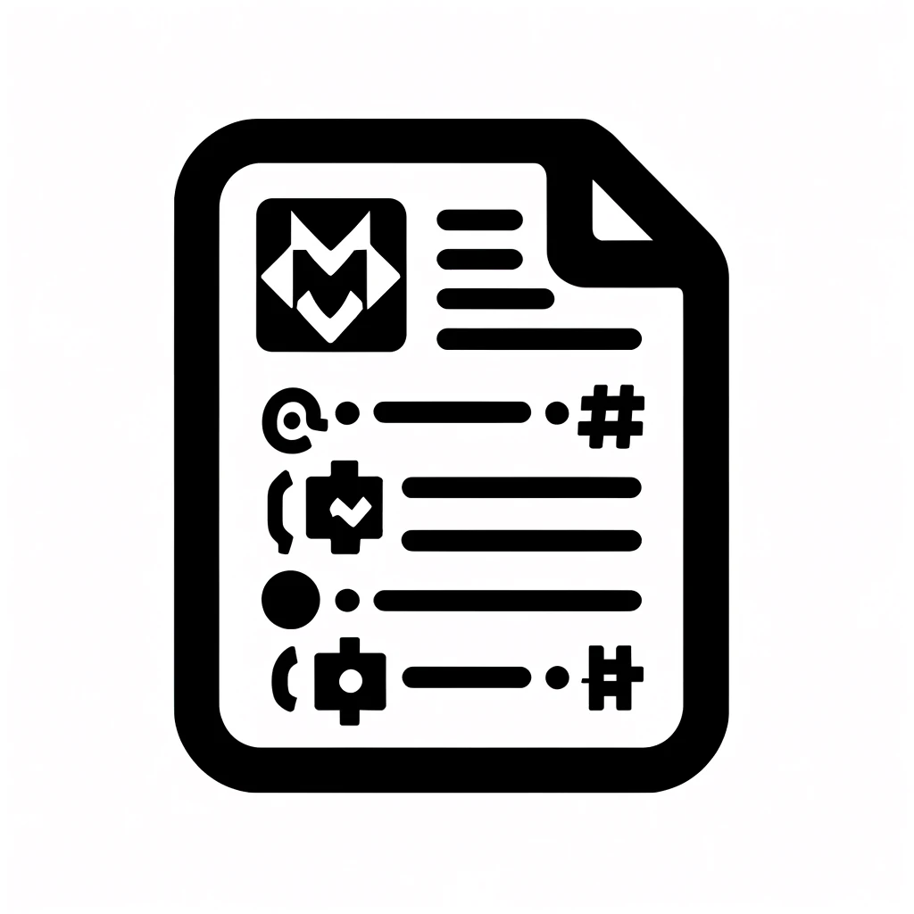

# Markdown Resume Web Generator

<center></center>

Welcome to the Markdown Resume Web Generator! This tool is designed to make it incredibly easy for anyone to generate and host their own resume website using Markdown files. With just a few simple steps, you can have your professional resume up and running, hosted on GitHub Pages for free.

## Features

- **Easy to Use:** Fork the repository, rename it, and you're almost done.
- **Customizable:** Modify the Markdown files to fit your resume content.
- **Automatically Deployed:** Utilizes GitHub Pages for hassle-free hosting.

## Getting Started

Follow these steps to set up your own resume website:

### 1. Fork the Repository

Visit the [Markdown Resume Web Generator repository](https://github.com/98yejin/98yejin.github.io/tree/refactor) and fork it to your own GitHub account.

### 2. Rename the Repository

Rename the forked repository to `{yourusername}.github.io`, where `{yourusername}` is your GitHub username.

### 3. Set Up Your Environment

Before deploying your resume, you need to set up the necessary environment on your machine:

- Ensure you have Python installed. If not, download and install it from [python.org](https://www.python.org/).
- Clone your forked repository to your local machine.
- Open a terminal or command prompt and navigate to the cloned repository's directory.
- Install the required dependencies by running:

  ```bash
  pip install -r requirements.txt
  ```

### 4. Customize Your Resume

- Edit or replace the Markdown files in the repository with your own resume content. There are placeholder files you can start with and modify according to your needs.
- After customizing your resume, generate the static files by executing:

  ```bash
  python staticbuilder.py build
  ```

- Push your changes to your repository.

### 5. Enable GitHub Pages

- Go to the repository settings on GitHub.
- Navigate to the "Pages" section.
- Select the `main` branch and `/ (root)` as the source.
- Click "Save", and GitHub Pages will automatically build and deploy your website.

### 6. Access Your Resume Website

Open a browser and go to `https://{yourusername}.github.io`. You should see your resume website live!

## Customization

The project is structured to be easily customizable. You can:

- Edit the `index.html` file to change the layout.
- Modify the stylesheets for design adjustments.
- Update the Markdown files for content changes.

## Contributing

Contributions are welcome! Feel free to submit pull requests with improvements or new features.

## License

This project is open source and available under the [MIT License](LICENSE).

## Acknowledgments

Special thanks to all contributors and users. Your support and interest make this project possible.

---

Happy resume building! For any questions or feedback, please open an issue on the GitHub repository.
